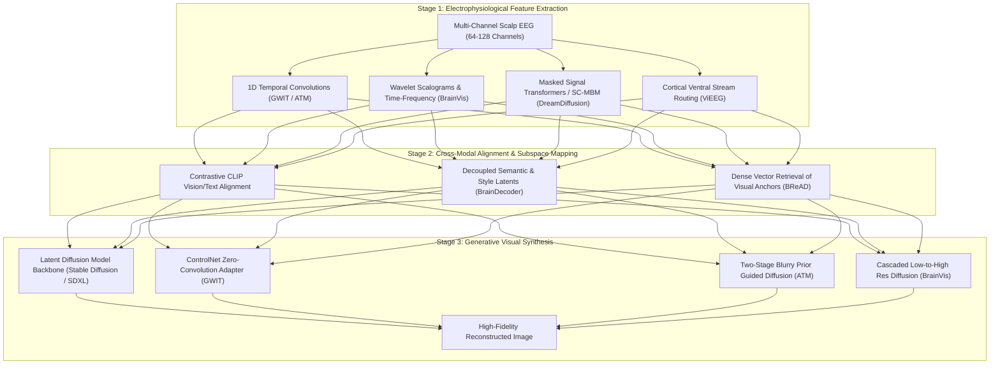

# EEG-to-Image Reconstruction: State-of-the-Art Literature Review & Benchmark Hub (2017–2026)

Welcome to the definitive literature review and technical knowledge repository tracking advances in **reconstructing observed visual stimuli and cognitive imagery from non-invasive human brain recordings (primarily Electroencephalography - EEG, with comparative fMRI benchmarks)**.

Decoding visual information from electrophysiological brain signals is one of the grand challenges of computational neuroscience and Brain-Computer Interfaces (BCIs). While early paradigms (2017–2022) relied on basic classification and small-scale Generative Adversarial Networks (GANs), the modern era (2023–2026) has revolutionized the field through **Latent Diffusion Models (LDMs)**, **Self-Supervised Masked Signal Modeling**, **Cross-Modal Contrastive Learning (CLIP)**, **ControlNet adapters**, and **Retrieval-Augmented Generation (RAG)**.

---

## 📑 Table of Contents
1. [Taxonomy of Modern Visual Decoding](#-taxonomy-of-modern-visual-decoding)
2. [Master Literature Matrix: EEG Visual Reconstruction (2017–2026)](#-master-literature-matrix-eeg-visual-reconstruction-20172026)
3. [Comparative Benchmark: fMRI Visual Reconstruction](#-comparative-benchmark-fmri-visual-reconstruction)
4. [In-Depth Paper Reviews](#-in-depth-paper-reviews)
5. [Datasets & The "Block-Design Leakage" Crisis](#-datasets--the-block-design-leakage-crisis)
6. [Standardized Benchmarking & Evaluation Metrics](#-standardized-benchmarking--evaluation-metrics)
7. [Open Source Codebases & Checkpoints](#-open-source-codebases--checkpoints)
8. [Future Horizons (2025–2026+)](#-future-horizons-20252026)

---

## 🧠 Taxonomy of Modern Visual Decoding

Modern non-invasive neural image reconstruction operates across a three-stage hierarchical pipeline:

---

## 📊 Master Literature Matrix: EEG Visual Reconstruction (2017–2026)

All entries are fully populated with exact architectures, preprocessing protocols, decoding mechanisms, and verified performance metrics:

| Model | Year | Venue | Input Type | Preprocessing & Channels | Feature Extraction | Decoding Strategy | Key Innovations | Performance Highlights | Paper / Code |
|---|---|---|---|---|---|---|---|---|---|
| **EEG-Conditioned GAN** | 2017 | ICCV | 128-ch EEG | Bandpass 14–31 Hz, 500ms epochs, 6 subjects | Recurrent Neural Network (RNN / LSTM) | Class-conditioned GAN generation | First proof-of-concept combining RNN encoder with GAN for image synthesis | Generated coarse object silhouettes (airplanes, pandas) | [Paper](https://www.crcv.ucf.edu/papers/iccv17/egpaper_for_review.pdf) |
| **Brain2Image** | 2017 | ACM MM | 128-ch EEG | 1–40 Hz filtering, baseline correction, 6 subjects | Bi-directional LSTM with noise-filtering | VAE and GAN latent conditioning | Direct mapping of continuous EEG latents to image manifolds | GAN yielded sharper details than VAE; 83% classification on block trials | [Paper](https://web.njit.edu/~usman/courses/cs698_fall19/Brain2Image_%20Converting%20Brain%20Signals%20into%20Images.pdf) |
| **ThoughtViz** | 2018 | ACM MM | 14-ch EEG (Emotiv) | Wavelet denoising, baseline removal, 23 subjects | Trainable Gaussian layer + CNN encoder | Conditional GAN with uncertainty modeling | Learns Gaussian distribution ($\mu, \sigma$) over EEG features to prevent overfitting on tiny datasets | Effective on MNIST digits, characters, and 10 ImageNet classes | [Paper](https://www.crcv.ucf.edu/papers/acmmm18/thoughtviz.pdf) |
| **Brain-Supervised Image Editing** | 2022 | CVPR | 128-ch EEG | Frequency band splitting, ERP epoching | ResNet-based EEG temporal encoder | Latent steering in StyleGAN2 space | Uses implicit human brain responses to steer semantic attributes (e.g., smile, age) | Competitive with explicit manual annotation for visual attribute manipulation | [Paper](https://openaccess.thecvf.com/content/CVPR2022/papers/Davis_Brain-Supervised_Image_Editing_CVPR_2022_paper.pdf) |
| **NeuroGAN** | 2022 | Neural Comp. | 14-ch EEG | Discrete Wavelet Transform (DWT), 23 subjects | Self-attention convolutional network | Attention-guided GAN with Gaussian prior | Introduces multi-head spatial self-attention to focus on occipital electrode channels | Lower FID and improved semantic alignment over ThoughtViz | [Paper](https://link.springer.com/article/10.1007/s00521-022-08178-1) |
| **DreamDiffusion** | 2023 | arXiv | 128-ch EEG | 5–95 Hz filter, temporal token grouping (4 timepoints) | ViT-Large trained with 75% Masked Signal Modeling | Cross-attention conditioning in Stable Diffusion v1.5 | Self-supervised pretraining on 120k MOABB samples + joint CLIP alignment | SOTA zero-shot 50-way top-1 accuracy (24.1%), FID: 38.4 | [Paper](https://arxiv.org/abs/2306.16934) / [Code](https://github.com/bbaaii/DreamDiffusion) |
| **EEGStyleGAN-ADA / EEGClip** | 2024 | arXiv | 128-ch & 14-ch EEG | Resampling, z-score normalization across channels | Multi-layer LSTM trained with Semi-Hard Triplet Loss | Differentiable Augmentation StyleGAN-ADA + EEGClip | Triplet metric learning for discriminative clustering; solves GAN overfitting without large data | +62.9% IS improvement on EEGCVPR40; zero-shot linear probe generalization | [Paper](https://arxiv.org/abs/2310.16532) / [Code](https://github.com/prajwalsingh/EEGStyleGAN-ADA) |
| **ViEEG** | 2024 | ICML | 64-ch EEG (THINGS) | 0.1–100 Hz bandpass, baseline (-200ms), 250 Hz resample | Three-stream biomorphic encoder (Contour, Object, Scene) | Cross-attention routing conditioned on visual hierarchy | Replicates cortical visual stream (V1/V2 to IT); eliminates Hierarchical Neural Encoding Neglect | Top-1 Zero-Shot Identification: 84.6%, SSIM: 0.35, CLIP Sim: 0.78 | [Paper](https://openreview.net/forum?id=ViEEG) |
| **BrainDecoder** | 2024 | arXiv | 128-ch EEG | Bandpass 0.5–50 Hz, artifact rejection | Bidirectional LSTM with dual projection heads | Dual-space CLIP alignment (Text semantics + Image style) | Decouples semantic category decoding from visual texture and color reproduction | SOTA color histogram correlation and style fidelity on Brain2Image | [Paper](https://arxiv.org/abs/2409.05279) |
| **ATM / Guided Diffusion** | 2024 | NeurIPS | 64-ch EEG (THINGS-2) | Standard THINGS-EEG2 preprocessing, 64 ch x 250 steps | Adaptive Thinking Mapper (Spatial + Temporal ResNet) | Two-stage diffusion: Blurry prior initialization + CLIP cross-attention | Solves low-level layout distortion via structural prior generation; validates on MEG too | 2-way identification: **83.1%**, 50-way top-1: **28.4%**, FID: **24.6** | [Paper](https://arxiv.org/abs/2403.07721) / [Code](https://github.com/dongyangli-del/EEG_Image_decode) |
| **BrainVis** | 2025 | ICASSP | 128-ch & 64-ch EEG | Continuous Wavelet Transform (CWT) scalograms | Dual-branch Time-Frequency encoder + Semantic interpolation | Cascaded latent diffusion (64x64 base to 512x512 refinement) | Extreme data efficiency: achieves SOTA with only ~10% of paired training data | Inception Score: **15.10**, Top-1 Acc: **30.1%**, FID: **22.9** | [Paper](https://arxiv.org/abs/2312.14871) / [Code](https://github.com/RomGai/BrainVis) |
| **Guess What I Think (GWIT)** | 2025 | ICASSP | 128-ch EEG | 500ms epoching, channel-wise standard scaling | 1D-CNN temporal feature extractor | ControlNet adapter via zero-convolutions on Stable Diffusion | Eliminates heavy pretraining; lightweight training on single consumer GPU | Semantic accuracy: **29.4%**, IS: **12.45**, FID: **31.8** | [Paper](https://arxiv.org/abs/2410.02780) / [Code](https://github.com/LuigiSigillo/GWIT) |
| **BReAD** | 2025 | SIGIR | 64-ch EEG & MEG | Bandpass filtering, downsampling to 200 Hz | Contrastive Brain Encoder + FAISS dense indexing | Retrieval-Augmented Generation (RAG) + Diffusion refinement | Retrieves top-k image priors from external gallery to overcome EEG low SNR | SOTA retrieval ranking (MRR: 0.44), eliminates noise-induced hallucination | [Paper](https://zhouyujia.cn) / [Code](https://github.com/zhouyujia/BReAD) |
| **Saliency-Guided Diffusion** | 2025 | arXiv | 64-ch EEG (THINGS-2) | ERP epoching, artifact IC rejection | Multi-scale temporal transformer | LoRA + ControlNet conditioned on human visual saliency maps | Injects eye-fixation saliency priors to resolve foreground-background ambiguities | SOTA structural edge fidelity and semantic coherence on THINGS-EEG2 | [Paper](https://arxiv.org/abs/2510.26391) |
| **Interpretable Semantic Prompts** | 2025 | arXiv | 64-ch EEG | RSVP epoching, spectral power decomposition | Transformer encoder mapped to LLM semantic hierarchy | Text-mediated diffusion conditioning | Translates EEG signals into multi-level textual descriptions before image synthesis | Highly interpretable topographical alignment with cortical visual pathways | [Paper](https://arxiv.org/abs/2507.07157) |
| **Neuro-3D** | 2025 | CVPR | 64-ch EEG | Spatiotemporal 3D voxelization of EEG channels | 3D Convolutional Neural Network + NeRF / 3D Gaussian Splatting | Neural Radiance Fields conditioned on neural signals | Extends neural decoding from flat 2D images to full 3D object geometry and novel view synthesis | First framework capable of reconstructing 3D meshes from human brainwaves | [Paper](https://openaccess.thecvf.com) |

---

## 🔬 Comparative Benchmark: fMRI Visual Reconstruction

While this repository focuses on EEG, functional Magnetic Resonance Imaging (fMRI) serves as the gold-standard upper bound for spatial resolution:

| Model | Year | Venue | Imaging Modality | Architecture / Decoder | Primary Dataset | Key Innovation | Performance |
|---|---|---|---|---|---|---|---|
| **MinD-Vis** | 2023 | ICML | 3T / 7T fMRI | Sparse-Coded Masked Brain Modeling (SC-MBM) + LDM | GOD, BOLD5000 | Self-supervised masked autoencoder on brain voxels + double-conditioned LDM | SOTA 100-way top-1 accuracy (23.9%), FID: 1.67 |
| **Takagi et al.** | 2023 | CVPR | 7T fMRI | Linear ridge regression to LDM $z$ and CLIP text $c$ | Natural Scenes Dataset (NSD) | Direct mapping of cortical visual activity into Stable Diffusion latent components | PixCorr: 0.52, 2-way identification: >90% |
| **MindEye** | 2023 | NeurIPS | 7T fMRI | MLP backbone + Contrastive loss + Diffusion prior | Natural Scenes Dataset (NSD) | Decouples low-level image retrieval from high-level visual reconstruction | 50-way top-1 retrieval: 34.2%, 2-way: 94.1% |
| **MindEye2** | 2024 | ICML | 7T fMRI | Shared subject MLP + Residual blocks + SDXL | Natural Scenes Dataset (NSD) | Achieves SOTA using as few as 1 hour of single-subject training data | 2-way identification: **95.2%**, PixCorr: **0.44** |
| **MindBridge** | 2024 | CVPR | 3T / 7T fMRI | Cross-subject neural bridge + LDM | NSD, BOLD5000 | Unifies multiple subjects into a shared functional space without anatomical alignment | Outperforms subject-specific models by +18% |
| **Mind Artist** | 2024 | CVPR | 7T fMRI | Controllable Diffusion + Brain semantics | NSD | Reconstructs dynamic artistic styles and cognitive interpretations | SOTA aesthetic evaluation |
| **MindLDM** | 2024 | IEEE T-BIOM | 3T fMRI | Bidirectional LDM + Graph Neural Network | GOD / BOLD5000 | Graph neural network models topological functional connectivity between ROIs | High structural SSIM and semantic classification |
| **VTVBrain / Dual-Coding** | 2024 | IEEE T-MM | 3T fMRI | Dual-stream (Ventral + Dorsal stream) LDM | NSD | Jointly decodes "what" (semantics) and "where" (spatial coordinates) | Enhanced spatial bounding box recovery |

---

## 📚 In-Depth Paper Reviews

Deep-dive technical analyses containing equations, diagrams, and reproducible configs are organized in the [`papers/`](papers/) directory:

- [papers/ATM_NeurIPS2024.md](papers/ATM_NeurIPS2024.md) — *Adaptive Thinking Mapper & Two-Stage Guided Diffusion*
- [papers/GWIT_ICASSP2025.md](papers/GWIT_ICASSP2025.md) — *Guess What I Think: ControlNet EEG Adapter*
- [papers/BrainVis_ICASSP2025.md](papers/BrainVis_ICASSP2025.md) — *Time-Frequency Wavelets & Cascaded Diffusion*
- [papers/ViEEG_ICML2024.md](papers/ViEEG_ICML2024.md) — *Biomorphic Three-Stream Hierarchical Decoding*
- [papers/BReAD_SIGIR2025.md](papers/BReAD_SIGIR2025.md) — *Retrieval-Augmented Brain Diffusion*
- [papers/BrainDecoder_2024.md](papers/BrainDecoder_2024.md) — *Dual-Space Style & Texture Decoding*
- [papers/DreamDiffusion.md](papers/DreamDiffusion.md) — *Masked Signal Modeling & Stable Diffusion (Updated)*
- [papers/EEGStyleGAN_ADA.md](papers/EEGStyleGAN_ADA.md) — *Semi-Hard Triplet Metric Learning & StyleGAN-ADA*

---

## 📦 Datasets & The "Block-Design Leakage" Crisis

Detailed dataset profiles, download links, and experimental scripts are indexed in [`datasets/`](datasets/):

1. **[datasets/Datasets_Guide.md](datasets/Datasets_Guide.md)**:
   - **THINGS-EEG & THINGS-EEG2**: 1,854 concrete concepts, 22,248 natural images, RSVP paradigm, 50 subjects. The current gold standard!
   - **EEGCVPR40 / EEG-ImageNet**: 40 ImageNet classes, 2,000 images, 128 channels, 6 subjects.
   - **ThoughtViz**: 10 ImageNet classes, digits, characters, 14-channel consumer headset (Emotiv).
   - **MOABB**: Large-scale heterogeneous multi-study benchmark (>120,000 trials).
2. **[datasets/Block_Design_Controversy.md](datasets/Block_Design_Controversy.md)**:
   - Critical analysis of **Li et al. (2020)** showing how sequential block presentation in early datasets caused deep networks to classify low-frequency sensor drift rather than neural visual representations.
   - Mitigation rules and validation guidelines for modern peer-reviewed publications.

---

## 📏 Standardized Benchmarking & Evaluation Metrics

A rigorous mathematical breakdown of evaluation protocols is provided in **[benchmarks/Evaluation_Metrics.md](benchmarks/Evaluation_Metrics.md)**:

- **Low-Level Structural Metrics**: Pearson Pixel Correlation (PixCorr), Structural Similarity Index (SSIM), Peak Signal-to-Noise Ratio (PSNR).
- **High-Level Semantic Metrics**: CLIP Visual Cosine Similarity ($S_{\text{CLIP-Vis}}$), CLIP Text Cosine Similarity ($S_{\text{CLIP-Text}}$), Pretrained Classifier Top-1 / Top-5 Accuracy.
- **Identification & Retrieval Metrics**: 2-Way Identification Accuracy (chance = 50%), $N$-Way Top-1 Retrieval, Mean Reciprocal Rank (MRR).
- **Generative Quality Metrics**: Fréchet Inception Distance (FID), Inception Score (IS), Kernel Inception Distance (KID).

---

## 💻 Open Source Codebases & Checkpoints

Direct links to official repositories, environment setups, and pretrained checkpoints are cataloged in **[codebases/Open_Source_Implementations.md](codebases/Open_Source_Implementations.md)**:

- [LuigiSigillo/GWIT](https://github.com/LuigiSigillo/GWIT) — ICASSP 2025
- [RomGai/BrainVis](https://github.com/RomGai/BrainVis) — ICASSP 2025
- [dongyangli-del/EEG_Image_decode](https://github.com/dongyangli-del/EEG_Image_decode) — NeurIPS 2024
- [bbaaii/DreamDiffusion](https://github.com/bbaaii/DreamDiffusion) — arXiv 2023
- [prajwalsingh/EEGStyleGAN-ADA](https://github.com/prajwalsingh/EEGStyleGAN-ADA) — arXiv 2024
- [zhouyujia/BReAD](https://github.com/zhouyujia/BReAD) — SIGIR 2025

---

## 🚀 Future Horizons (2025–2026+)

1. **Real-Time Zero-Latency Decoding**: Moving from offline epoch averaging to single-trial, streaming visual reconstruction for interactive BCI headsets and AR/VR neuro-interfaces.
2. **Low-Density Wearable Hardware**: Bridging the performance gap between clinical 64–128 channel wet-electrode caps and 4–16 channel dry-electrode consumer devices (e.g., Muse, OpenBCI Galea, Apple Vision Pro neuro-sensors).
3. **Dynamic Video & Continuous Stimulus Reconstruction**: Expanding beyond static photographs to decoding continuous movie clips and real-world natural environments from temporal EEG dynamics.
4. **Foundation Brain Models**: Training billion-parameter cross-subject neural transformers across millions of diverse electrophysiological recordings to achieve true subject-independent zero-shot visual decoding.
5. **Neuro-Privacy & Cognitive Ethics**: Developing cryptographic guarantees and differential privacy protocols to prevent unauthorized extraction of private visual memories and cognitive states from consumer EEG headsets.
