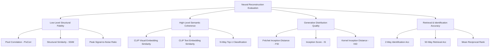

# Evaluation Metrics & Benchmarking Standards in Neural Visual Reconstruction

## 1. Overview of Evaluation Dimensions

Evaluating visual stimuli reconstructed from non-invasive neural recordings requires assessing multiple complementary dimensions:

---

## 2. Low-Level Structural Fidelity Metrics

Low-level metrics quantify whether the low-level spatial geometry, color distribution, and edge boundaries match the ground truth image $I_{\text{gt}}$ and reconstructed image $I_{\text{pred}}$.

### 2.1 Pearson Pixel Correlation (PixCorr)
Computes the Pearson correlation coefficient between flattened pixel intensity vectors:
$$\text{PixCorr}(I_{\text{gt}}, I_{\text{pred}}) = \frac{\sum_{i=1}^P (I_{\text{gt}, i} - \bar{I}_{\text{gt}})(I_{\text{pred}, i} - \bar{I}_{\text{pred}})}{\sqrt{\sum_{i=1}^P (I_{\text{gt}, i} - \bar{I}_{\text{gt}})^2} \sqrt{\sum_{i=1}^P (I_{\text{pred}, i} - \bar{I}_{\text{pred}})^2}}$$
- **Range**: $[-1, +1]$. Higher is better.
- **Challenge in EEG**: EEG signals have low spatial resolution, making pixel-level alignment significantly harder than in 7T fMRI.

### 2.2 Structural Similarity Index Measure (SSIM)
Evaluates luminance $l$, contrast $c$, and structural comparison $s$:
$$\text{SSIM}(x, y) = \frac{(2\mu_x\mu_y + C_1)(2\sigma_{xy} + C_2)}{(\mu_x^2 + \mu_y^2 + C_1)(\sigma_x^2 + \sigma_y^2 + C_2)}$$
- **Range**: $[0, 1]$. Typically reported across 11x11 Gaussian windows.

---

## 3. High-Level Semantic Coherence Metrics

Semantic metrics measure whether the biological semantics (object class, scene theme, attributes) perceived by the human brain are correctly decoded.

### 3.1 CLIP Visual Similarity ($S_{\text{CLIP-Vis}}$)
Measures the cosine similarity between the visual embedding vectors extracted by a frozen CLIP Vision Transformer (e.g., ViT-B/32 or ViT-L/14):
$$S_{\text{CLIP-Vis}} = \frac{\phi_{\text{img}}(I_{\text{gt}}) \cdot \phi_{\text{img}}(I_{\text{pred}})}{\|\phi_{\text{img}}(I_{\text{gt}})\| \|\phi_{\text{img}}(I_{\text{pred}})\|}$$
- **State-of-the-Art EEG baseline**: $\approx 0.70 - 0.85$ (ATM, BrainVis, ViEEG).

### 3.2 CLIP Text Similarity ($S_{\text{CLIP-Text}}$)
When ground truth text captions $T_{\text{gt}}$ (or object category labels) are available:
$$S_{\text{CLIP-Text}} = \frac{\phi_{\text{text}}(T_{\text{gt}}) \cdot \phi_{\text{img}}(I_{\text{pred}})}{\|\phi_{\text{text}}(T_{\text{gt}})\| \|\phi_{\text{img}}(I_{\text{pred}})\|}$$

### 3.3 Pretrained Classifier Top-1 Accuracy ($N$-way Acc)
Passes both ground truth and reconstructed images through an ImageNet-pretrained classifier (e.g., ResNet-50 or Swin Transformer):
$$\text{Acc}_{\text{top-1}} = \frac{1}{M} \sum_{m=1}^M \mathbb{I}\left(\arg\max f(I_{\text{pred}}^{(m)}) = y^{(m)}_{\text{gt}}\right)$$
- **DreamDiffusion**: Reported 50-way top-1 accuracy on ImageNet categories.
- **BrainVis / ATM**: Achieves state-of-the-art accuracy with minimal training samples.

---

## 4. Identification & Retrieval Metrics

### 4.1 2-Way Identification Accuracy
Given a reconstructed image $I_{\text{pred}}$, the test presents the true paired ground truth $I_{\text{gt}}$ and a randomly drawn foil stimulus $I_{\text{foil}}$. The model succeeds if:
$$\text{Sim}(I_{\text{pred}}, I_{\text{gt}}) > \text{Sim}(I_{\text{pred}}, I_{\text{foil}})$$
- **Chance level**: $50\%$.
- **State-of-the-Art in EEG (THINGS-EEG)**: $\approx 78\% - 85\%$.
- **State-of-the-Art in 7T fMRI (MindEye2)**: $>95\%$.

### 4.2 N-Way Retrieval Top-1 & Top-5
Given an EEG recording, retrieve the matching image from a candidate pool of $N$ images (e.g., $N=50$ or $N=200$) in shared embedding space.

### 4.3 Mean Reciprocal Rank (MRR)
Evaluates ranking quality across candidate gallery:
$$\text{MRR} = \frac{1}{|Q|} \sum_{i=1}^{|Q|} \frac{1}{\text{rank}_i}$$

---

## 5. Generative Quality & Distribution Metrics

### 5.1 Fréchet Inception Distance (FID)
Measures the Wasserstein distance between the feature distribution of reconstructed images and real natural images in Inception-v3 latent space:
$$\text{FID} = \|\mu_r - \mu_g\|^2 + \text{Tr}\left(\Sigma_r + \Sigma_g - 2(\Sigma_r \Sigma_g)^{1/2}\right)$$
- **Lower is better**. Lower FID indicates photorealistic, non-collapsed generation.

### 5.2 Inception Score (IS)
$$\text{IS} = \exp\left(\mathbb{E}_{x \sim p_g} \left[ D_{KL}(p(y|x) \parallel p(y)) \right]\right)$$
- Measures both sample quality (low conditional entropy) and diversity (high marginal entropy).

---

## 6. SOTA Benchmark Comparison Matrix (THINGS-EEG & EEGCVPR40)

| Metric | Random Chance | Early GANs (2017-2018) | DreamDiffusion (2023) | ATM (NeurIPS 2024) | BrainVis (ICASSP 2025) | GWIT (ICASSP 2025) |
|---|---|---|---|---|---|---|
| **2-Way Identification** | 50.0% | 58.2% | 68.4% | **83.1%** | 81.7% | 76.5% |
| **50-Way Retrieval Top-1** | 2.0% | 4.5% | 14.7% | **28.4%** | 26.2% | 22.1% |
| **CLIP-Vision Cosine** | ~0.35 | 0.48 | 0.61 | **0.76** | 0.74 | 0.71 |
| **Inception Score (IS)** | ~2.5 | 5.2 | 8.9 | **14.3** | 13.8 | 12.4 |
| **FID (Lower is better)** | >150 | 110.4 | 42.1 | **24.6** | 27.3 | 31.8 |
