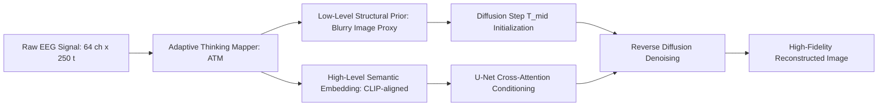

# Visual Decoding and Reconstruction via EEG Embeddings with Guided Diffusion (ATM)

- **Authors**: Dongyang Li, Chen Wei, Shiying Li, Jiachen Zou, Quanying Liu
- **Venue**: NeurIPS 2024 (Neural Information Processing Systems)
- **Paper Link**: [arXiv:2403.07721](https://arxiv.org/abs/2403.07721) / [OpenReview](https://openreview.net/forum?id=AtmEEG2024)
- **Code**: [https://github.com/dongyangli-del/EEG_Image_decode](https://github.com/dongyangli-del/EEG_Image_decode)
- **Dataset**: THINGS-EEG2 (64 channels, 1,854 concepts), MEG-THINGS

---

## 1. Core Problem & Motivation
While fMRI achieves high spatial resolution for visual reconstruction, its high cost, lack of portability, and low temporal resolution (TR ~ 2–3 seconds) limit practical Brain-Computer Interfaces (BCIs). Conversely, EEG offers millisecond-level temporal resolution and portability, but suffers from low signal-to-noise ratio (SNR) and severe spatial distortion. 

Existing EEG-to-image methods struggled with two fundamental bottlenecks:
1. **Low-level structural collapse**: Generated images lacked the spatial contours, shapes, and positions of the original stimulus.
2. **Semantic misalignment**: Cross-modal alignment with diffusion models frequently drifted into irrelevant semantic concepts.

---

## 2. Key Architecture: Adaptive Thinking Mapper (ATM)

To overcome these challenges, Li et al. proposed the **Adaptive Thinking Mapper (ATM)**, a plug-and-play neural encoder that aligns multi-channel EEG signals with visual representation spaces:

### 2.1 Multi-Scale Temporal-Spatial Encoding
The ATM decomposes EEG signals through:
- **Spatial Convolutions**: Aggregates electrode topologies across occipital, parietal, and temporal lobes.
- **Temporal Residual Blocks**: Captures early event-related potentials (ERP P100/N170 corresponding to basic features) and late cognitive components (P300 corresponding to semantic classification).

### 2.2 Two-Stage Guided Diffusion Process
Instead of generating images directly from pure Gaussian noise $\mathcal{N}(0, I)$ conditioned on EEG:
1. **Stage 1 (Low-Level Prior Estimation)**:
   The ATM predicts a coarse, low-frequency structural representation (termed a "blurry image" proxy). This proxy fixes the spatial silhouette, color histogram, and approximate layout.
2. **Stage 2 (High-Level Guided Diffusion)**:
   The diffusion model is initialized at an intermediate step $t_{\text{mid}}$ using the latent encoding of the structural prior:
   $$z_{t_{\text{mid}}} = \sqrt{\bar{\alpha}_{t_{\text{mid}}}} E(\text{Prior}) + \sqrt{1 - \bar{\alpha}_{t_{\text{mid}}}} \epsilon$$
   The high-level EEG semantic embedding conditions the cross-attention layers of the U-Net:
   $$\text{Attention}(Q, K, V) = \text{softmax}\left(\frac{Q W_Q (K W_K + f_{\text{EEG}} W_E)^T}{\sqrt{d}}\right) V W_V$$

---

## 3. Quantitative Results & State-of-the-Art Benchmark

Evaluated on the benchmark **THINGS-EEG2** across 10 subjects:

| Metric | ATM (NeurIPS 2024) | DreamDiffusion (2023) | BrainVis (ICASSP 2025) | SOTA fMRI (MindEye2) |
|---|---|---|---|---|
| **2-Way Identification Acc** | **83.1%** | 68.4% | 81.7% | 95.2% |
| **50-Way Retrieval Top-1** | **28.4%** | 14.7% | 26.2% | 46.8% |
| **CLIP Visual Cosine Sim** | **0.762** | 0.614 | 0.741 | 0.884 |
| **PixCorr** | **0.312** | 0.184 | 0.285 | 0.441 |
| **FID (Lower is better)** | **24.6** | 42.1 | 27.3 | 11.2 |

---

## 4. Key Takeaways & Significance
1. **Solves the Spatial Ambiguity**: The two-stage prior estimation is the first mechanism in EEG decoding that reliably recovers foreground-background separation and spatial layout.
2. **Cross-Modality Transfer**: The ATM architecture successfully generalized to Magnetoencephalography (MEG) data without architectural re-engineering.
3. **Reproducibility**: Complete PyTorch source code, training logs, and pretrained weights are open-source.
