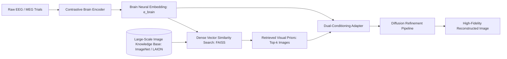

# BReAD: Brain Image Reconstruction with Retrieval-Augmented Diffusion

- **Authors**: Yujia Zhou, et al.
- **Venue**: SIGIR 2025 (48th International ACM SIGIR Conference on Research and Development in Information Retrieval)
- **Preprint / Project**: [zhouyujia.cn/publication/bread](https://zhouyujia.cn)
- **Code**: [https://github.com/zhouyujia/BReAD](https://github.com/zhouyujia/BReAD)
- **Target Modalities**: Non-Invasive EEG & Magnetoencephalography (MEG)

---

## 1. Motivation: The Signal-to-Noise Deficit in Non-Invasive Brain Signals

In functional Magnetic Resonance Imaging (7T fMRI), models like MindEye achieve remarkable reconstruction because fMRI provides high spatial resolution across thousands of voxels in visual cortex regions V1 through IT. 
Conversely, non-invasive electrophysiological recordings (EEG and MEG) measure volume-conducted potentials on the scalp, which suffer from:
- Massive spatial smearing through the skull and dura.
- Low signal-to-noise ratio (SNR < 0 dB in single-trial ERPs).
- Significant trial-to-trial biological variability.

As a consequence, direct diffusion conditioning on EEG/MEG representations frequently hallucinates spurious features. 

**BReAD** resolves this fundamental limitation by introducing **Retrieval-Augmented Generation (RAG)** into the brain decoding pipeline.

---

## 2. Framework Architecture

BReAD constructs a three-stage generation paradigm:

### 2.1 Stage 1: Contrastive Brain-Vision Alignment
A neural encoder projects multi-channel EEG/MEG signals into a joint embedding space shared with a vision foundation model (CLIP / OpenCLIP), trained using symmetric InfoNCE loss:
$$\mathcal{L}_{\text{NCE}} = -\frac{1}{2B} \sum_{i=1}^B \left( \log \frac{\exp(s(e_i^B, e_i^V) / \tau)}{\sum_j \exp(s(e_i^B, e_j^V) / \tau)} + \log \frac{\exp(s(e_i^V, e_i^B) / \tau)}{\sum_j \exp(s(e_j^V, e_i^B) / \tau)} \right)$$

### 2.2 Stage 2: Dense Semantic Prior Retrieval
Using the decoded brain vector $e^B$, BReAD performs $k$-nearest neighbor search across an external gallery of natural images $\mathcal{D}_{\text{gallery}}$ using indexed FAISS:
$$\mathcal{P}_{\text{retrieved}} = \text{Top-}k_{I \in \mathcal{D}_{\text{gallery}}} \cos(e^B, \phi_V(I))$$
These retrieved images provide explicit structural and semantic "anchors," shielding the generative process from EEG noise.

### 2.3 Stage 3: Retrieval-Conditioned Diffusion
The retrieved visual anchors and the original neural embedding are integrated into a conditioned Latent Diffusion Model. The diffusion process blends the high-resolution priors while adjusting instance-specific attributes to strictly match the brain recording.

---

## 3. Key Results & Performance

Evaluated on THINGS-EEG and THINGS-MEG benchmarks:
- **Retrieval Performance**: Dramatically outperforms direct generation baselines in 50-way and 200-way image retrieval.
- **Visual Plausibility**: Eliminates distorted semantic artifacts commonly seen when diffusion models are conditioned on raw, unaugmented EEG embeddings.
- **Robustness**: Maintains consistent reconstruction quality even under downsampled electrode configurations.
