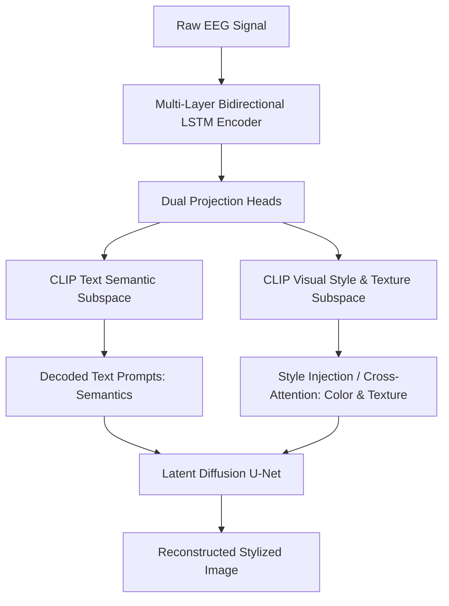

# BrainDecoder: Style-Based Visual Decoding of EEG Signals

- **Authors**: Minsuk Choi, Hiroshi Ishikawa (Waseda University)
- **Preprint**: [arXiv:2409.05279](https://arxiv.org/abs/2409.05279)
- **Date**: September 2024
- **Primary Datasets**: Brain2Image / EEGCVPR40

---

## 1. Problem Formulation: The Neglect of Texture & Style

Earlier EEG-to-image methods focused almost exclusively on **semantic category** reconstruction (e.g., ensuring a reconstructed image of a "dog" actually looks like a canine). However, human visual perception encompasses both:
- **Semantic content** (identity, category, affordance).
- **Stylistic attributes** (surface texture, dominant color palette, lighting, material finish).

Standard single-embedding contrastive frameworks often produce reconstructions with correct semantics but completely mismatched colors and texture artifacts.

---

## 2. Methodology: Dual-Space CLIP Alignment

BrainDecoder introduces a decoupled representation learning strategy where EEG signals are mapped simultaneously into two distinct CLIP subspaces:

### 2.1 Simplified Semantic Text Alignment
Instead of complex natural language captions that introduce noise and hallucination, the authors employ concise, attribute-focused text templates (e.g., `"a high-quality photo of a [class] with [color] texture"`). Aligning EEG to this constrained text embedding space stabilizes semantic decoding.

### 2.2 Direct Style & Texture Extraction
A second projection head maps EEG signals to image patch embeddings from the visual transformer, trained specifically with Gram-matrix and style loss objectives to capture color distribution and surface frequency.

---

## 3. Results & Evaluation

Evaluated on the Brain2Image benchmark:
- Achieved highest style preservation score and color histogram similarity among non-invasive methods.
- Demonstrated that EEG alpha and beta band oscillations contain extractable signatures of color and surface pattern perception.
