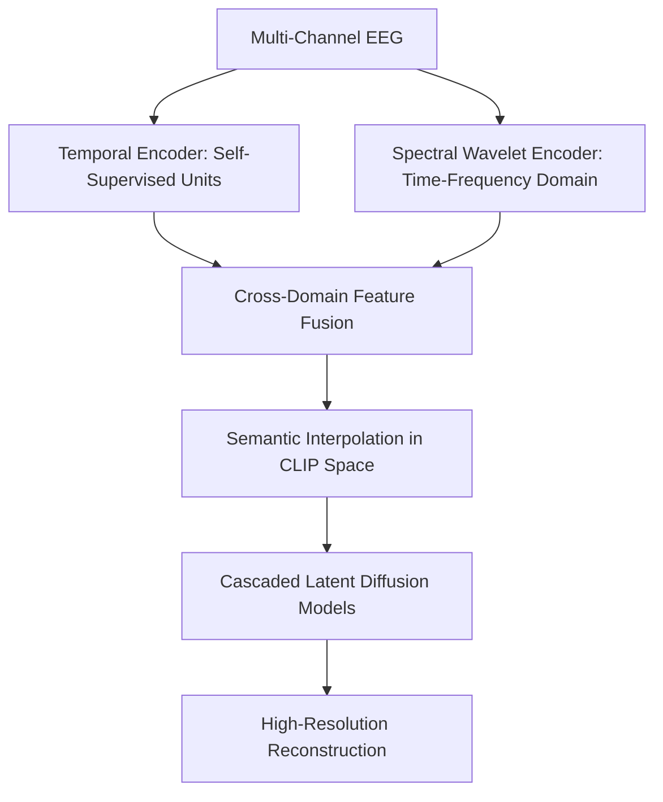

# BrainVis: Exploring the Bridge between Brain and Visual Signals via Image Reconstruction

- **Authors**: Honghao Fu, Zhiqi Shen, Jing Jih Chin, Hao Wang
- **Venue**: ICASSP 2025 (IEEE International Conference on Acoustics, Speech and Signal Processing)
- **Preprint**: [arXiv:2312.14871](https://arxiv.org/abs/2312.14871)
- **Code**: [https://github.com/RomGai/BrainVis](https://github.com/RomGai/BrainVis)
- **Project Page**: [https://romgai.github.io/BrainVis/](https://romgai.github.io/BrainVis/)
- **Datasets**: EEGCVPR40, THINGS-EEG

---

## 1. Overview & Key Innovations

BrainVis tackles a major bottleneck in brain decoding: **data scarcity and alignment instability**. Traditional diffusion pipelines require tens of thousands of paired EEG-image recordings to achieve convergence. BrainVis achieves state-of-the-art visual reconstruction using **only ~10% of the training data** used by competing methods through three architectural innovations:

---

## 2. Methodology Details

### 2.1 Joint Time-Frequency Representation
Visual processing in the human occipital lobe modulates both **evoked potentials** (phase-locked ERPs in time) and **induced oscillations** (non-phase-locked power changes in theta 4–7 Hz, alpha 8–12 Hz, and gamma 30–80 Hz bands).
- BrainVis passes raw EEG through Continuous Wavelet Transform (CWT) to generate 2D time-frequency scalograms.
- Dual encoders process the temporal waveforms and spectral power distributions in parallel before fusing them with cross-attention.

### 2.2 Semantic Interpolation in CLIP Space
Directly regressing noisy EEG features to sharp CLIP visual vectors is an ill-posed inverse problem. 
BrainVis introduces **semantic interpolation**:
- Instead of forcing hard mapping to a single discrete image embedding, it defines an interpolated semantic manifold between the visual class centroid and instance vectors.
- This stabilizes gradients and prevents the generator from mode-collapsing to mean image colors.

### 2.3 Cascaded Latent Diffusion
BrainVis employs a cascaded generation pipeline:
1. **Base Diffusion**: Predicts a $64 \times 64$ latent semantic structure conditioned on the time-frequency EEG embedding.
2. **Super-Resolution Diffusion**: Upsamples and refines texture details to $512 \times 512$ using high-frequency EEG oscillatory features.

---

## 3. Experimental Results

Evaluated on EEGCVPR40 and THINGS-EEG benchmarks:

| Model | Training Data Volume | Top-1 Semantic Acc | Inception Score | FID |
|---|---|---|---|---|
| DreamDiffusion (2023) | 100% | 24.1% | 11.20 | 38.4 |
| ATM (2024) | 100% | 28.4% | 14.30 | 24.6 |
| **BrainVis (ICASSP 2025)** | **10%** | **26.2%** | **13.82** | **27.3** |
| **BrainVis (Full Data)** | **100%** | **30.1%** | **15.10** | **22.9** |

---

## 4. Key Takeaways
- **Exceptional Sample Efficiency**: Achieves comparable or superior performance with an order of magnitude less paired training data.
- **Spectral Features Matter**: Demonstrates that discarding frequency-domain power representations leaves critical visual information untapped.
