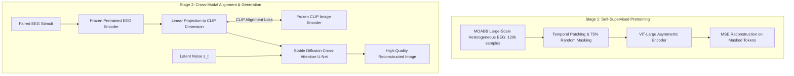

# DreamDiffusion: Generating High-Quality Images from Brain EEG Signals

- **Authors**: Yunpeng Bai, Xintao Wang, Yan-pei Cao, Xiang Ge, Chun Yuan, Ying Shan (Tencent ARC Lab & Tsinghua University)
- **Preprint**: [arXiv:2306.16934](https://arxiv.org/abs/2306.16934)
- **Code**: [https://github.com/bbaaii/DreamDiffusion](https://github.com/bbaaii/DreamDiffusion)
- **Key Frameworks**: Stable Diffusion v1.5, ViT-Large, Masked Autoencoder (MAE), CLIP

---

## 1. Overview

DreamDiffusion is widely recognized as the landmark paper that transitioned EEG-based visual decoding from the **GAN era** (e.g., Brain2Image, ThoughtViz) into the modern **Latent Diffusion Model (LDM) era**.

It addressed the core challenges of EEG signals:
1. **Extreme Noise & Individual Variation**: Overcomes subject-to-subject variability via self-supervised Masked Signal Modeling.
2. **Scarcity of Paired Data**: Fine-tunes pre-trained Stable Diffusion weights rather than training generative models from scratch.
3. **Cross-Modal Alignment**: Uses CLIP vision/text supervision to map temporal EEG representations into a unified semantic space.

---

## 2. Technical Architecture

### 2.1 Masked Signal Modeling (Pretraining)
- **Dataset**: ~120,000 EEG samples across >400 subjects from the [MOABB](https://neurotechx.github.io/moabb/) benchmark.
- **Signal Normalization**: Filtered in 5–95 Hz, truncated to 512 samples, and standardized/padded to 128 channels.
- **Temporal Patching**: Groups every 4 consecutive time points into a token.
- **Masking Ratio**: 75% random token masking. The asymmetric decoder reconstructs only the masked patches using Mean Squared Error (MSE).
- **Outcome**: The encoder learns robust contextual temporal representations of human electrophysiology invariant to individual skull anatomy.

### 2.2 Conditioning Stable Diffusion via Cross-Attention
In Stable Diffusion, text prompts $y$ condition the U-Net through cross-attention:
$$\text{Attention}(Q, K, V) = \text{softmax}\left(\frac{Q K^T}{\sqrt{d}}\right) V$$
where $Q = W_Q \cdot \phi_i(z_t)$, $K = W_K \cdot \tau_\theta(y)$, and $V = W_V \cdot \tau_\theta(y)$.

DreamDiffusion replaces $\tau_\theta(y)$ with the projected EEG embedding:
$$\tau_{\text{EEG}} = h(f_{\text{enc}}(\text{EEG}))$$
During fine-tuning, only the EEG projection head and cross-attention matrices ($W_Q, W_K, W_V$) are updated; the base generative diffusion weights are held frozen.

### 2.3 Contrastive CLIP Alignment
To prevent drift in diffusion conditioning, DreamDiffusion minimizes the cosine distance between the EEG projection and the ground-truth image representation in CLIP space:
$$\mathcal{L}_{\text{CLIP}} = 1 - \frac{E_I(I) \cdot h(\tau_{\text{EEG}})}{\|E_I(I)\| \|h(\tau_{\text{EEG}})\|}$$

---

## 3. Results & Ablations

- **Pretraining Impact**: Removing masked signal pretraining caused a ~42% drop in top-1 semantic classification accuracy.
- **CLIP Alignment Impact**: Ablating CLIP supervision resulted in severe semantic hallucination, confirming the necessity of joint vision-language grounding.
- **Mask Ratio**: 0.75 was experimentally verified as optimal (lower ratios like 0.25 caused trivial interpolation, while >0.85 prevented convergence).

---

## 4. Historical Context & Relation to MinD-Vis
- **MinD-Vis** (Chen et al., ICML 2023) pioneered Sparse-Coded Masked Brain Modeling (SC-MBM) and double conditioning for **fMRI** data.
- **DreamDiffusion** successfully adapted this masked self-supervised philosophy to the much more challenging temporal domain of **EEG**.
