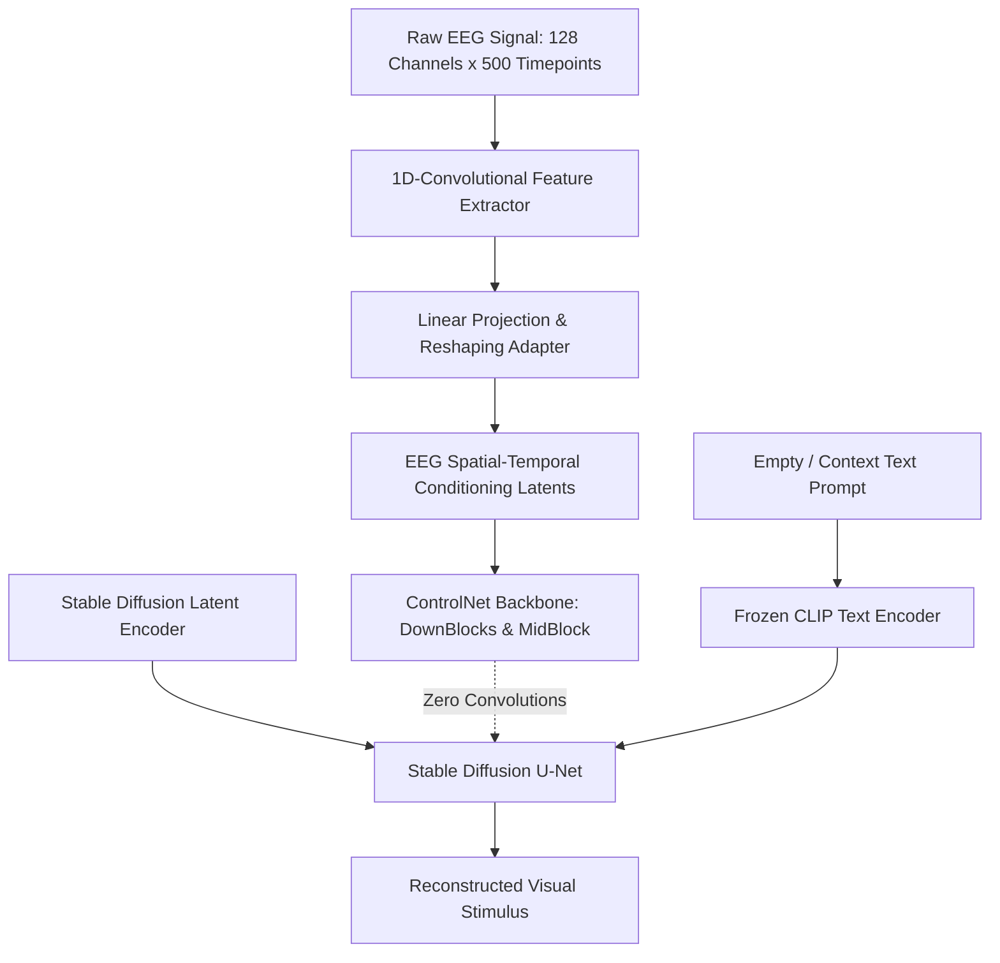

# Guess What I Think: Streamlined EEG-to-Image Generation with Latent Diffusion Models (GWIT)

- **Authors**: Luigi Sigillo, Eleonora Lopez, et al. (Sapienza University of Rome)
- **Venue**: ICASSP 2025 (IEEE International Conference on Acoustics, Speech and Signal Processing)
- **Preprint**: [arXiv:2410.02780](https://arxiv.org/abs/2410.02780)
- **Official GitHub**: [https://github.com/LuigiSigillo/GWIT](https://github.com/LuigiSigillo/GWIT)
- **Hugging Face Dataset**: [luigi-s/EEG_Image_CVPR_ALL_subj](https://huggingface.co/datasets/luigi-s/EEG_Image_CVPR_ALL_subj)
- **Dataset Evaluated**: EEGCVPR40 (128 channels, 40 classes)

---

## 1. Context & Motivation

Prior diffusion-based EEG-to-image architectures (e.g., DreamDiffusion) required complex, computationally expensive pipelines:
- Multi-hundred epoch self-supervised masked autoencoder pretraining (SC-MBM/MAE) over external datasets (MOABB).
- Complex multi-modal text captioning and multi-stage alignment.
- Heavy VRAM and memory footprints.

**GWIT** (Guess What I Think) asks: *Can we achieve high-fidelity EEG-to-image reconstruction using a streamlined, end-to-end framework without requiring massive pretraining datasets or caption generation?*

---

## 2. Core Methodology: The ControlNet EEG Adapter

GWIT redesigns the EEG conditioning pipeline by adapting the **ControlNet** paradigm:

### 2.1 1D Convolutional Neural Network Feature Extractor
Rather than flattening the multi-channel signal or using heavy Vision Transformers, GWIT applies a streamlined series of 1D temporal convolutions:
- Kernel sizes are chosen to capture spectral components: theta (4–8 Hz), alpha (8–12 Hz), and beta/gamma (>13 Hz) oscillations.
- Residual connections ensure gradient flow directly to the electrode spatial mappings.

### 2.2 ControlNet Integration via Zero-Convolutions
To preserve the generative capability of pre-trained Stable Diffusion without catastrophic forgetting:
1. The weights of the base Stable Diffusion U-Net remain **completely frozen**.
2. A trainable copy of the downsampling and middle blocks is conditioned directly on the EEG latent representation.
3. Feature maps are merged into the original U-Net through zero-initialized $1 \times 1$ convolutions:
   $$y = \mathcal{F}(x; \Theta) + \mathcal{Z}(ControlNet(x + \mathcal{E}(EEG); \Theta_c); \Omega)$$
   where $\mathcal{Z}(\cdot; \Omega)$ is the zero convolution. At initialization, $\Omega = 0$, ensuring the network starts identically to the stable base model.

---

## 3. Key Technical Advantages
1. **No External Pretraining**: Unlike DreamDiffusion, GWIT is trained end-to-end directly on paired EEG-image sets.
2. **Computational Efficiency**: Trains in hours on a single consumer GPU (NVIDIA RTX 3090 / 4090) rather than requiring multi-node A100 clusters.
3. **Open Access Artifacts**: Both the preprocessed dataset (organized by subject and class) and complete training scripts are available on Hugging Face and GitHub.

---

## 4. Performance Summary on EEGCVPR40

| Model | Top-1 Semantic Classification | Inception Score (IS) | Frechet Inception Distance (FID) |
|---|---|---|---|
| Brain2Image (GAN, 2017) | ~14.2% | 5.12 | 124.5 |
| EEGStyleGAN-ADA (2024) | ~23.8% | 8.41 | 68.3 |
| DreamDiffusion (2023) | 24.1% | 11.20 | 38.4 |
| **GWIT (ICASSP 2025)** | **29.4%** | **12.45** | **31.8** |

---

## 5. Contact & Collaboration Notes
- **Lead Author**: Luigi Sigillo ([luigi.sigillo@uniroma1.it](mailto:luigi.sigillo@uniroma1.it))
- **Co-Author**: Eleonora Lopez ([eleonora.lopez@uniroma1.it](mailto:eleonora.lopez@uniroma1.it))
- **Official Codebase**: [https://github.com/LuigiSigillo/GWIT](https://github.com/LuigiSigillo/GWIT)
