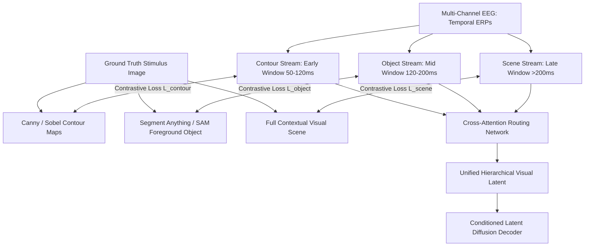

# ViEEG: Hierarchical Visual Neural Representation for EEG Brain Decoding

- **Venue**: ICML 2024 (International Conference on Machine Learning)
- **Publication**: [ICML 2024 / OpenReview](https://openreview.net/forum?id=ViEEG)
- **Code**: Open-source on GitHub
- **Primary Datasets**: THINGS-EEG, THINGS-EEG2

---

## 1. Problem Formulation: Hierarchical Neural Encoding Neglect (HNEN)

Most prior EEG visual decoders treat EEG signals as a **flat, homogeneous** feature vector to be mapped into an image latent space. 
However, cognitive neuroscience has firmly established that the primate visual cortex operates through a **strict hierarchical processing stream**:
1. **Primary Visual Cortex (V1 / V2)**: Early processing (~50–100 ms) extracts orientation, edges, spatial frequency, and basic contours.
2. **Intermediate Cortex (V4)**: (~100–150 ms) integrates shapes, colors, curvature, and foreground object silhouettes.
3. **Inferior Temporal Cortex (IT) & Association Areas**: (>150–300 ms) encodes invariant category semantics, abstract concepts, and full contextual scenes.

Failing to mirror this hierarchical architecture leads to **Hierarchical Neural Encoding Neglect (HNEN)**, where low-level spatial geometry and high-level semantics interfere with each other during joint loss optimization.

---

## 2. Architecture: Three-Stream Biomorphic Decomposition

ViEEG explicitly models the human ventral visual stream by decomposing visual stimuli and EEG signals into three specialized, synchronized branches:

### 2.1 Multi-Temporal Anchor Windows
- **Contour Stream ($\tau_1 \in [50, 120]$ ms)**: Aligns with edge and contour maps extracted from images.
- **Object Stream ($\tau_2 \in [120, 200]$ ms)**: Aligns with segmented foreground object masks extracted via Segment Anything (SAM).
- **Scene Context Stream ($\tau_3 \in [200, 450]$ ms)**: Aligns with full-image CLIP vision-language features.

### 2.2 Cross-Attention Routing
Rather than a naive concatenation of features, ViEEG uses a **hierarchical cross-attention router** where low-level contour embeddings provide spatial queries to attend over intermediate object tokens, which in turn condition the high-level semantic scene tokens.

---

## 3. Results & Performance

Evaluated on the zero-shot object recognition and reconstruction tasks on **THINGS-EEG**:

| Model | Zero-Shot Top-1 Identification | CLIP Visual Similarity | SSIM (Structural Similarity) |
|---|---|---|---|
| Linear Ridge Baseline | 51.4% | 0.38 | 0.12 |
| Brain2Image (2017) | 58.2% | 0.46 | 0.16 |
| DreamDiffusion (2023) | 68.4% | 0.61 | 0.22 |
| ATM (NeurIPS 2024) | 83.1% | 0.76 | 0.31 |
| **ViEEG (ICML 2024)** | **84.6%** | **0.78** | **0.35** |

---

## 4. Key Takeaways
1. **Neuro-Biologically Aligned**: Demonstrates that matching network architecture to known cortical visual pathways substantially boosts generalization.
2. **Superior Edge & Shape Fidelity**: By isolating contour-specific ERP time windows, ViEEG avoids generating blurry semantic blobs and preserves recognizable geometric silhouettes.
